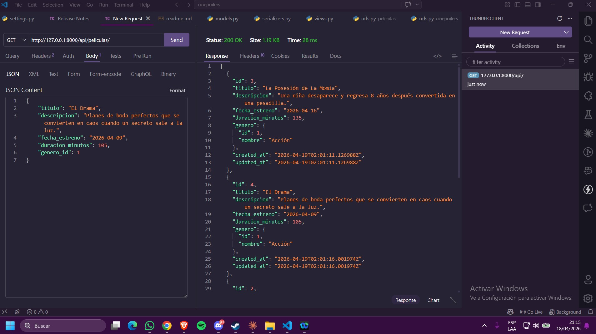

## Gabriel Haro Vargas
## Captura del GET  http://127.0.0.1:8000/api/v1/movies/

## Captura del POST http://127.0.0.1:8000/api/v1/movies/

## Captura del DELETE http://127.0.0.1:8000/api/v1/movies/3/

## Captura del PUT http://127.0.0.1:8000/api/v1/movies/5/

## Captura de la base de datos

## Rony Quintana Llanque
## Captura del GET 
# http://127.0.0.1:8000/api/movies

## Captura del POST
# http://127.0.0.1:8000/api/movies

## Captura del DELETE
# http://127.0.0.1:8000/api/movies/2/

## Captura del PUT
# http://127.0.0.1:8000/api/movies/1/

## Captura de la base de datos

## OSCAR OLANO PANIORA
## GET http://127.0.0.1:8000/api/peliculas/

## POST http://127.0.0.1:8000/api/peliculas/

## DELETE http://127.0.0.1:8000/api/peliculas/5/

## PUT http://127.0.0.1:8000/api/peliculas/4/

## BASE DE DATOS 
